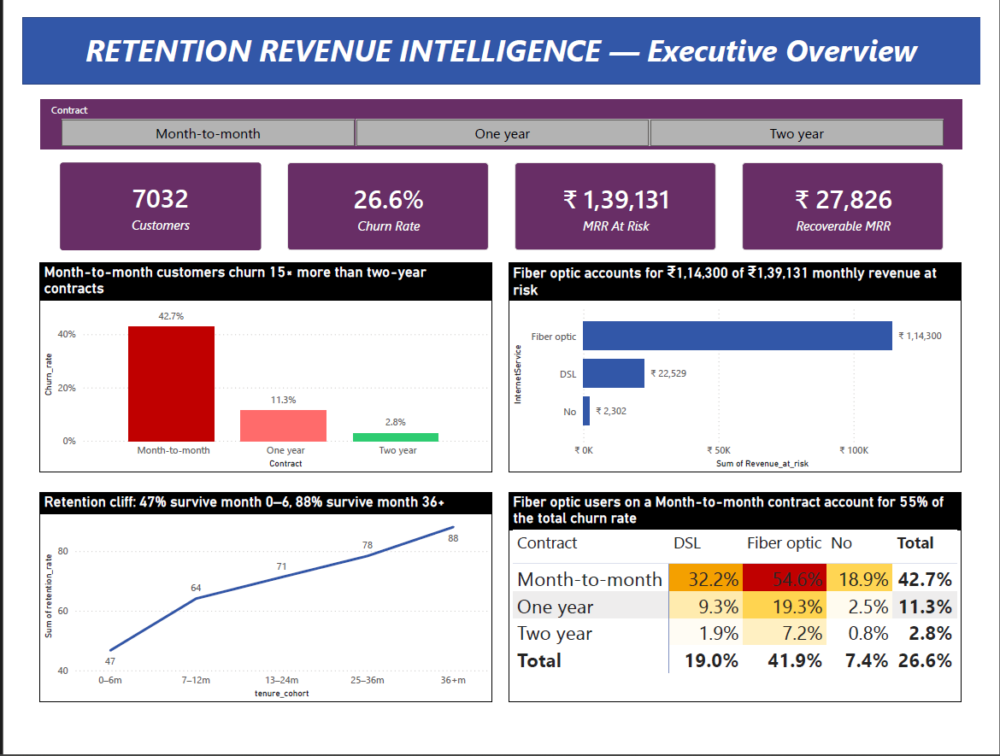
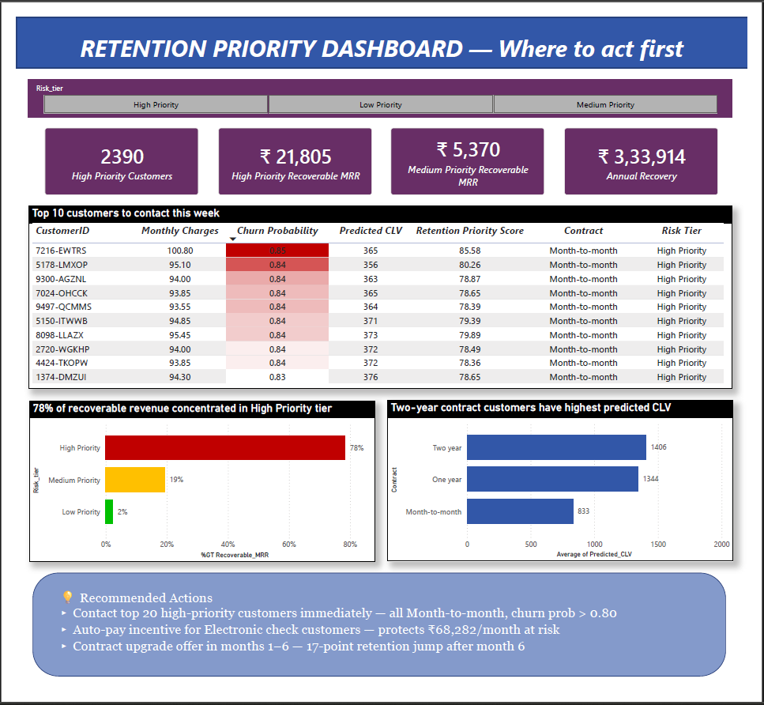

# 🔄 Retention Revenue Intelligence

> **End-to-end churn prediction and CLV scoring system built to identify 
> ₹3,33,912 in annual recoverable revenue across 7,032 SaaS customers.**



---

## 📌 Business Problem

A SaaS telecom provider is losing **26.6% of its customer base annually** 
— with nearly **₹1,39,131 in monthly recurring revenue at risk**. 

The business needed answers to three questions:
1. **Who** is most likely to churn?
2. **Which customers** represent the highest revenue risk?
3. **Where** should the retention team focus first to maximise MRR recovery?

This project delivers all three — using SQL analysis, machine learning, 
and an operational Power BI dashboard.

---

## 💡 Key Findings

| Finding | Detail |
|---------|--------|
| Overall churn rate | 26.6% — 1 in 4 customers lost |
| Monthly revenue at risk | ₹1,39,131 (30.5% of total MRR) |
| Highest risk segment | Month-to-month + Fiber optic + Electronic check — **60.4% churn rate** |
| Critical retention window | Months 0–6 — only 46.7% retention vs 88.1% at month 36+ |
| Model selected | Logistic Regression (AUC 0.835, Churn Recall 0.57) |
| Annual recoverable MRR | **₹3,33,912** at 20% retention rate |

---

## 🎯 Business Recommendations

**1. Contact top 20 high-priority customers immediately**
All Month-to-month contracts, churn probability > 0.80, MonthlyCharges > ₹100.
Retaining 20% = ₹1,000+/month from 20 targeted calls.

**2. Auto-pay incentive for Electronic check customers**
Highest-risk payment method. Offer ₹5/month discount to switch to auto-pay.
Revenue protected: ₹68,282 × 10% = **₹6,828/month — net positive from day one.**

**3. Contract upgrade campaign — months 1–6**
17-point retention jump after month 6 (46.7% → 64.1%).
Offer 10% discount on annual contract within first 6 months.
Converting 15% of at-risk cohort = **₹12,100/month recovered.**

---

## 🔍 Project Walkthrough

### Part 1 — SQL Analysis
8 business-driven queries covering:
- Overall churn rate and MRR at risk
- Churn by contract type, tenure, internet service, payment method
- High-risk segment identification (Contract × Internet × Payment)
- Cohort retention curve — pinpointing the 0–6 month danger zone

### Part 2 — Machine Learning
Two models trained and compared:

| Metric | Random Forest | Logistic Regression |
|--------|--------------|---------------------|
| AUC-ROC | 0.836 | 0.835 |
| Recall (Churned) | 0.48 | **0.57** |
| Precision (Churned) | **0.64** | 0.63 |

**Selected: Logistic Regression** — higher recall on churned class means 
34 additional at-risk customers caught per scoring cycle vs Random Forest, 
worth ₹2,516/month in additionally recoverable revenue.

Model calibration: avg predicted probability (0.267) matches actual 
churn rate (0.266) — confirming reliable probability scores.

### Part 3 — CLV Scoring & Retention Priority Matrix
Every customer scored on two metrics:
- **Predicted CLV** = MonthlyCharges × (1 − churn_probability) × 24
- **Retention Priority Score** = churn_probability × MonthlyCharges

Priority tiers derived from score distribution:

| Tier | Customers | Recoverable MRR |
|------|-----------|----------------|
| High Priority | 2,390 | ₹21,805 |
| Medium Priority | 2,321 | ₹5,370 |
| Low Priority | 2,321 | ₹651 |
| **Total** | **7,032** | **₹27,826/month** |

### Part 4 — Power BI Dashboard
Two-page operational dashboard:
- **Page 1:** Executive overview — churn KPIs, segment heatmap, retention curve
- **Page 2:** Retention priority — top 10 contact list, CLV by contract, 
  recoverable MRR by tier, recommended actions



---

## 🛠️ Tech Stack

| Layer | Tools |
|-------|-------|
| Data processing | Python, Pandas |
| SQL analysis | SQLite, DuckDB |
| Machine learning | Scikit-learn (LR, RF) |
| Visualisation | Power BI Desktop, DAX |
| Environment | Google Colab |
| Version control | Git, GitHub |

---

## 📁 Repository Structure

```
retention-revenue-intelligence/
│
├── data/
│   ├── raw/                          
│   └── cleaned/                      
│       ├── telco_churn_cleaned.csv
│       ├── telco_churn_scored.csv    
│       ├── segment_summary.csv
│       ├── cohort_retention.csv
│       └── top50_priority_contacts.csv
│
├── sql/
│   └── 01_churn_analysis.sql        
│
├── notebooks/
│   └── Retention_Revenue_Intelligence.ipynb
│
├── dashboard/
│   ├── Retention_Revenue_Intelligence.pbix
│   ├── dashboard_page1_executive_overview.png
│   └── dashboard_page2_retention_priority.png
│
└── README.md
```

## ▶️ How to Run

1. Clone the repo
```bash
git clone https://github.com/AchalaJain/retention-revenue-intelligence
```

2. Open `notebooks/Retention_Revenue_Intelligence.ipynb` in Google Colab

3. Update `PROJECT_PATH` in cell 1 to your Google Drive path

4. Run all cells in order

5. Open `dashboard/Retention_Revenue_Intelligence.pbix` in Power BI Desktop

---

## 📊 Dataset

**IBM Telco Customer Churn** — [Kaggle](https://www.kaggle.com/datasets/blastchar/telco-customer-churn)
- 7,032 customers × 21 features
- Contains demographics, services, contract type, payment method, churn status

---

*Built by [Achala Jain](https://www.linkedin.com/in/achala-jain-325377258) 
— Data Analyst | SQL · Python · Power BI · Databricks*
